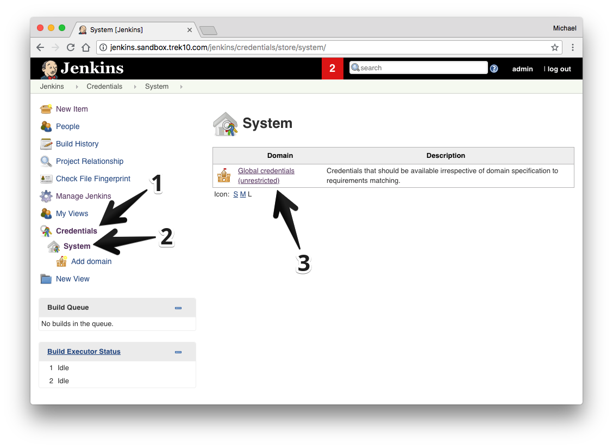
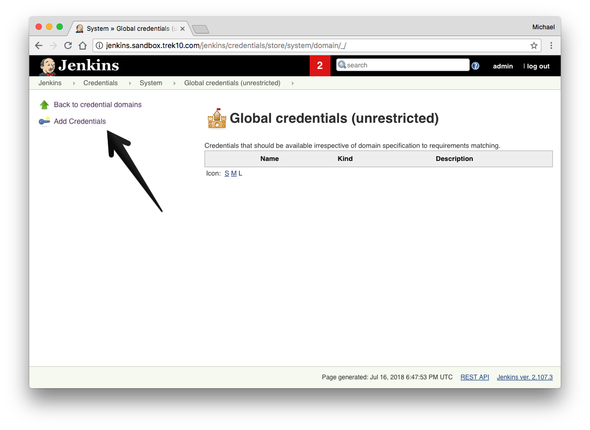
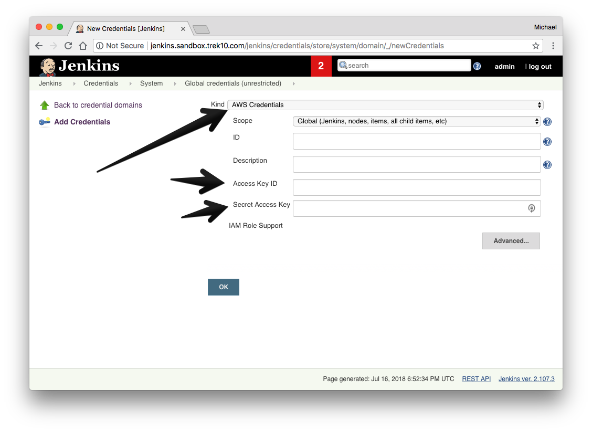
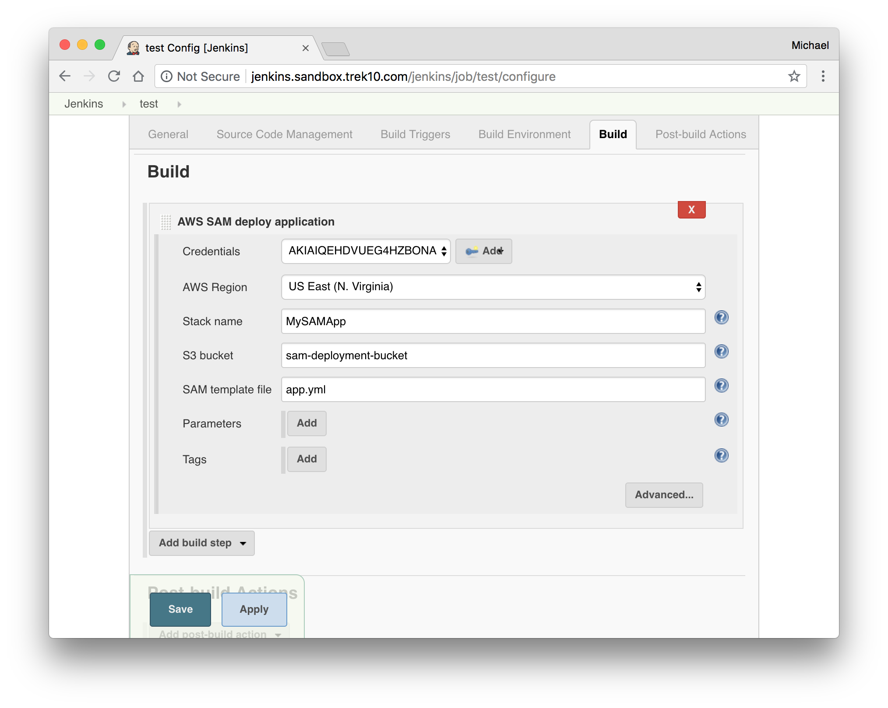
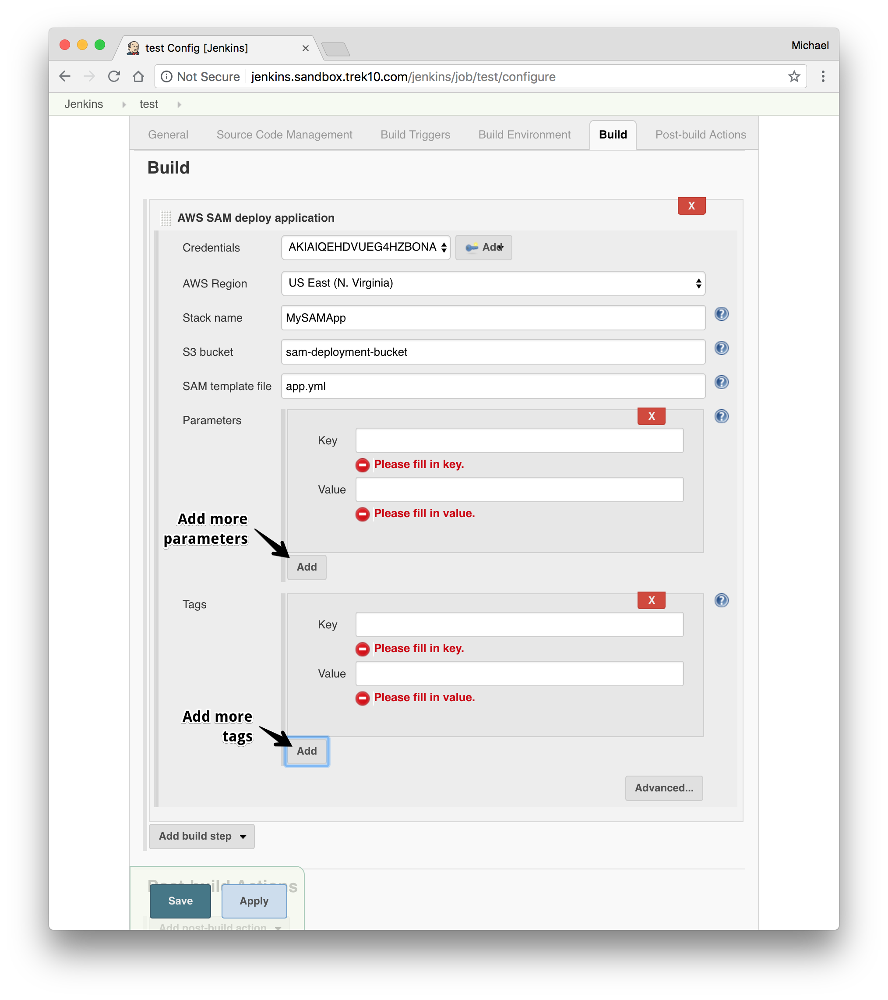
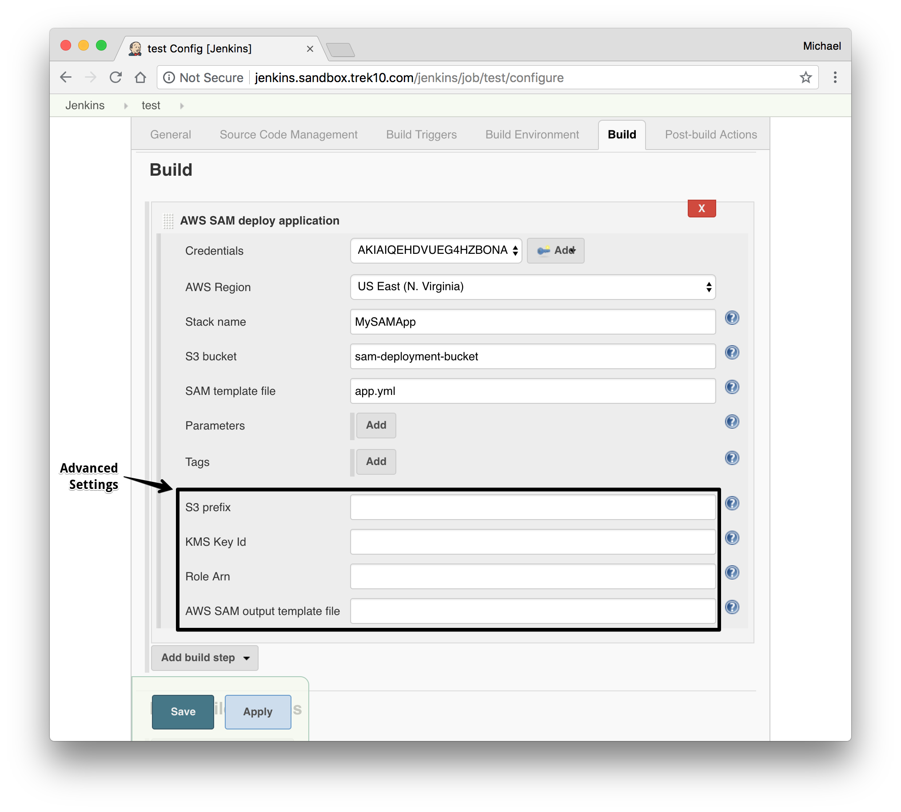

# AWS SAM plugin for Jenkins

[](LICENSE)
[](https://plugins.jenkins.io/aws-sam/)
[](https://ci.jenkins.io/job/Plugins/job/aws-sam-plugin/job/master/)

The AWS Serverless Application Model ([SAM](https://docs.aws.amazon.com/serverless-application-model/latest/developerguide/what-is-sam.html)) is an open-source framework you can use to build serverless applications on AWS.

This plugin helps you automate the deployments of your applications that are defined using SAM.

## Features

> If you wish to use the AWS SAM CLI directly, you can use [AWS SAM build images](https://docs.aws.amazon.com/serverless-application-model/latest/developerguide/serverless-image-repositories.html) with Pipeline's [built-in Docker support](https://www.jenkins.io/doc/book/pipeline/docker/).

- Custom build step
- [`samDeploy`](https://www.jenkins.io/doc/pipeline/steps/aws-sam/) Pipeline step
- Deploy SAM applications to AWS
- Package SAM applications to a S3 bucket
    - Use specific or auto-created S3 bucket (if not given, a bucket will be automatically created in your account for you)
- Template parameters support
- Template tags support
- Deploy to a specific region
- Use an S3 prefix for packaged artifacts to have fine-grained control of where artifacts are uploaded
- Use a specific KMS key for encrypting packaged artifacts at rest in S3
- Configurable deployment role

## Installation

1. Navigate to your Jenkins server
2. On the left, click "Manage Jenkins"
3. Scroll down to find "Manage Plugins" and click it
4. Look for the "AWS SAM" plugin

## Requirements

### AWS account

In order to deploy to AWS you must have an AWS account. Visit https://aws.amazon.com if you do not have one.

### AWS credential configuration

Before you can start building, you _must_ have your AWS credentials set up in Jenkins.
To do this:

1. From the main page of your jenkins server go to "Credentials" > "System" and then click on "Global Credentials."

  

2. Click "Add Credentials."

  

3. Select from the "Kind" dropdown "AWS Credentials."
4. Finish the form with your AWS access keys and click "OK."

  

### IAM setup

For deployment you'll need access to an S3 bucket (or permission to create one), 
CloudFormation and ChangeSet IAM lifecycle actions, as well as any IAM permissions
required to create the resources in your SAM (CloudFormation) template.

#### S3 policy (you may want to limit `Resource` to specific S3 Buckets)

```yaml
Version: '2012-10-17'
Statement:
  - Sid: SAMS3Actions
    Resource: '*'
    Effect: Allow
    Action:
      - s3:CreateBucket
      - s3:GetBucketLocation
      - s3:ListBucket
      - s3:PutObject
      - s3:PutObjectAcl
      - s3:PutObjectTagging
```

#### CloudFormation policy (you may want to limit `Resource` to specific stacks)

```yaml
Version: '2012-10-17'
Statement:
  - Sid: SAMCloudFormationActions
    Resource: '*'
    Effect: Allow
    Action:
      - cloudformation:ValidateTemplate
      - cloudformation:DescribeStacks
      - cloudformation:CreateChangeSet
      - cloudformation:DescribeChangeSet
      - cloudformation:ExecuteChangeSet
```

## Project configuration

There are a few steps to configuring your build.

1. In your project configuration, scroll down to build steps.
2. Add the "AWS SAM deploy application" build step.

### Configuring the build step

1. Select your AWS Credentials from the dropdown.
2. Select the target region to deploy to.
3. Give the build step a stack name.
4. _Optional:_ Enter an S3 bucket name to package the artifacts to.
    1. If you leave this blank, the S3 bucket will be auto-generated.
5. Give the path to the SAM template file.

  

6. _Optional:_ If your template has parameters, add parameters where necessary.
7. _Optional:_ Add any tags to the stack you'd like.

  

8. _Optional:_ Finish the "Advanced" configuration
    1. Give an S3 prefix to package the artifacts in the bucket under.
    2. Give a KMS Key ID to encrypt the packaged artifacts.
    3. Give a Role Arn that will be assumed by CloudFormation when executing the changeset.
9. Select an output template file for the package step to output to.

  
